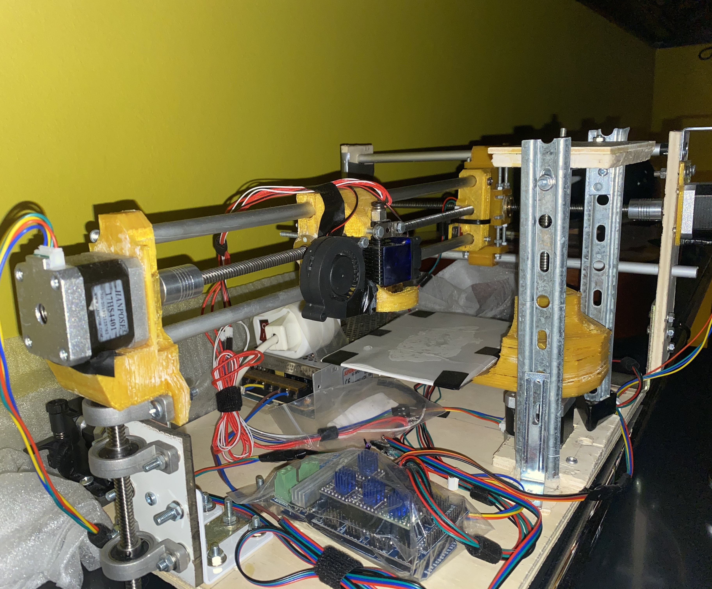

# MB3D-Printer
 

The 3D Printer I built during the 2020 quarantine. Like the [plotter project](https://github.com/bellimarco/DisegnatoreRemoto) I had just finished, it is based on a polar setup with two stepper motors for radius and angle, and another stepper for the bed height.

An Arduino Mega with the RAMPS shield controls the actuators, filament extruder, end stops, heat block and thermistors; it receives Gcodes via serial from a computer. The bottleneck in printing speed was the microcontroller frequency, which wasn't enough to handle both serial communication and a smooth stepper motor control (which requires constantly sending precisely timed step signals to the four steppers). Therefore, I decided to separated these two processes: the Arduino listens on the serial port until filling a buffer of about 50 Gcodes, and then it starts executing them until the buffer is empty. The occasional waiting time (+-1 sec) for the Gcode buffer to fill up results inevitably in some artifacts on the final print due to the stillness of the printhead.

To create the Gcodes from the stl files I used the Cura software. With a NodeJS program, I translated the Cura files (meant for a classic CoreXY design) to a custom Gcode standard created to fit the model of my 3D printer. Then, I create a local server on the computer with another NodeJS program (mb3d.js) which sends via serial the Gcodes to the Arduino. The printing process can be monitored by a rudimentary user interface on a webpage connecting to the server.

In addition, the printer was built from scratch using wood and metal parts from my local carpentry shop. Only after having built a functioning wooden prototype, could I upgrade it with better 3D printed parts. I wanted to avoid building my first 3D printer with 3D printed parts obtained somewhere else because that feels a bit like cheating, doesn't it ?

## Resources
For more images and videos of the project I refer to my [Google Drive folder](https://drive.google.com/drive/folders/1L6Rk5TGIUBfg1ZFhCpQsbyhUCCYRQrp4?usp=share_link).

 

 

 
